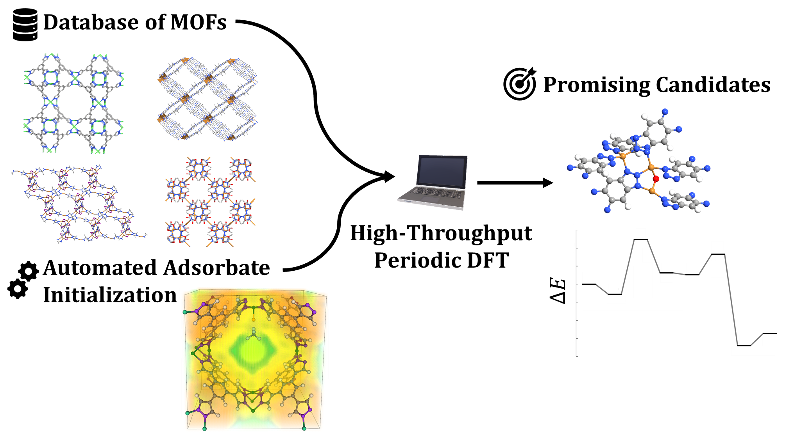

# PyMOFScreen
Python workflow for high-throughput DFT screening of MOFs using VASP. Relevant details for the code can be found in the following manuscript (once published):

A.S. Rosen, J.M. Notestein, R.Q. Snurr. "Identifying Promising Metal-Organic Frameworks for Heterogeneous Catalysis via High-Throughput Periodic Density Functional Theory", J. Comput. Chem (2019). DOI: 10.1002/jcc.25787 

[](https://zenodo.org/badge/latestdoi/113722940)



## What is PyMOFScreen?

High-throughput computational catalysis involving MOFs is a tricky business. Their large unit cells, diverse structures, and widely varying compositions make it challenging to achieve both a robust and high-performing workflow with little human interactions. PyMOFScreen solves this problem through multi-stage structural optimizations, a robust selection of optimization algorithms that are chosen on-the-fly, automatic error-handling, and much more. In the Snurr group, we have used PyMOFScreen to screen hundreds of MOFs using periodic DFT in a fully automated fashion. To automate the adsorbate construction process, refer to our [MOF-Adsorbate-Initializer](https://github.com/arosen93/mof-adsorbate-initializer) code.

## Ready-to-Run Examples

To get started, sample scripts are provided in `/examples` and include:
1. `volume_relaxation.py`. Perform a full volume relaxation on a database of MOF CIFs.
2. `ionic_relaxation.py`. Perform an ionic relaxation on a database of MOF CIFs.

## The screener

```python
class screener():
	"""
	This class constructs a high-throughput screening workflow
	"""
	def __init__(self,basepath,mofpath=None,kpts_path='Auto',kppas=None,
		submit_script=None,stdout_file=None):
```
The main tool to initialize a screening workflow is the `pymofscreen.screener` class. At the bare minimum, you must provide it the following arguments and keywords:
	
1. `basepath`: The base directory where the DFT screening results should be stored. The results are stored in `/basepath/results`, and any errors are stored in `/basepath/errors`.
2. `mofpath`: The path where the MOF CIF files are located.
3. `kpts_path` and/or `kppas`: If `kpts_path` is set to `auto`, PyMOFScreen will automatically generate a kpoint grid using the k-points per atom (KPPA) specified via the `kppas` keyword argument. The `kppas` argument should be a list with two entries: the low- and high-accuracy KPPAs to use (defaults to [100,1000]). Alternatively, one can provide a text file of all the desired k-points, specifying the path explicitly via `kpts_path` (see the `/examples` folder for an example k-points file.)
4. `submit_script`: The name of the job submission script.
5. `stdout_file`: The name of the standard output.

```python
def run_screen(self,cif_file,mode,spin_levels=None,acc_levels=None,niggli=True,calcs=calcs):
	"""
	Run high-throughput ionic or volume relaxations
	"""
```
Within the `screener` class is a function named `run_screen`. It informs the `screener` what type of job should be run and on what CIF file. Generally, only two parameters need to be changed:
	
1. `cif_file`: The name of the CIF file to optimize.
2. `mode`: The type of job to run, which can be either `mode='volume'` or `mode='ionic'`.

There are a few additional, optional paremeters:

3. `spin_levels`: By default, it is set to `spin_levels=['spin1','spin2']`, which tells PyMOFScreen to run a high-spin job followed by a low-spin job.
4. `acc_levels`: By default, it is set to `acc_levels=['scf_test','isif2_lowacc','isif2_medacc','isif2_highacc','final_spe']` and is the list of jobs to run for each MOF.
5. `niggli`: By default, it is set to `niggli=True` and tells PyMOFScreen to make a Niggli-reduced cell of your input file before running. This can be disabled with `niggli=False`.
6. `calcs`. This is series of ASE calculators that correspond to each entry in `acc_levels`. This automatically pulls the calculators from `pymofscreen.default_calculators.calcs`.

## Example

Now, that was a bit abstract. It's pretty easy in practice though! A minimal example for performing a volume relaxation is shown below.

```python
from pymofscreen.cif_handler import get_cif_files
from pymofscreen.screen import screener

#Set up paths
mofpath = '/path/to/my/CIFs/'
basepath = '/path/to/store/output/'
submit_script = '/path/to/submission/script/submit.sh'

#Get CIF files
cif_files = get_cif_files(mofpath)

#Construct screener object
s = screener(basepath,mofpath,submit_script=submit_script)

#Run screening
for cif_file in cif_files:
	mof = s.run_screen(cif_file,'volume')
```

## Defaults

Of course, it is essential to specify default parameters that should be used in VASP, such as the exchange-correlation functional, convergence criteria, and so on. This is done by importing `pymofscreen.default_calculators.defaults` and making modifications to the default parameters in the `defaults` dictionary. An example is shown below.

```python
from pymofscreen.cif_handler import get_cif_files
from pymofscreen.screen import screener
from pymofscreen.default_calculators import defaults

#Set up paths
mofpath = '/path/to/my/CIFs/'
basepath = '/path/to/store/output/'
submit_script = '/path/to/submission/script/submit.sh'

#Define defaults
defaults['xc'] = 'BEEF-vdW'
defaults['ivdw'] = 0
defaults['ediffg'] = -0.02 #and so on...

#Get CIF files
cif_files = get_cif_files(mofpath)

#Construct screener object
s = screener(basepath,mofpath,submit_script=submit_script)

#Run screening
for cif_file in cif_files:
	mof = s.run_screen(cif_file,'volume')
```

The parameters in the `defaults` dictionary are used in the `pymofscreen.default_calculators.calcs` function, which we suggest looking at before running PyMOFScreen for the first time. The `pymofscreen.default_calculators.calcs` function defines each job type previously specified in `acc_levels` and can be modified directly, if desired. The job specifications and parameters can be freely changed using any of [ASE's parameters for VASP](https://wiki.fysik.dtu.dk/ase/ase/calculators/vasp.html).

## Setup

### Installing PyMOFScreen

1. PyMOFScreen requires [Python](https://www.python.org/) 3.6 or newer. If you do not already have Python installed, the easiest option is to download the [Anaconda](https://www.anaconda.com/download/) distribution.
2. Download or clone the PyMOFScreen repository and run `pip install -r requirements.txt` followed by `pip install .` from the PyMOFScreen base directory. This will install PyMOFScreen and the required dependencies.
3. Since PyMOFscreen is built on [ASE](https://wiki.fysik.dtu.dk/ase/), you must make sure that your `VASP_PP_PATH` is set appropriately, as described [here](https://wiki.fysik.dtu.dk/ase/ase/calculators/vasp.html).
4. PyMOFScreen requires that VASP is installed on your compute cluster. The VASP build must be compiled with [VTSTools](http://theory.cm.utexas.edu/vtsttools/index.html) and must include both gamma-point only and standard builds. Follow the `compute_environ` instructions below to set up PyMOFScreen to run on your compute environment.

### Required Dependencies

PyMOFScreen will automatically install all the dependencies for you with the `pip install -r requirements.txt` command, but if you wish to do this manually or encounter issues, the required dependencies are as follows:
1. A slightly modified build of [ASE](https://wiki.fysik.dtu.dk/ase/) 3.16.2 or newer. The required modification adds support for checking if a VASP job has failed due to SCF convergence issues (via `atoms.calc.scf_converged`) and if it has reached the maximum number of ionic steps (via `atoms.calc.nsw_converged`). The custom build, denoted rASE, can be found [at this link](https://github.com/arosen93/rASE). Alternatively, you can directly patch `vasp.py` in `ase/ase/calculators/vasp/vasp.py` using the `vasp.py` script found [here](https://github.com/arosen93/rASE/blob/master/ase/calculators/vasp/vasp.py). 
2. [Pymatgen](http://pymatgen.org/) 2018.5.22 or newer. This is required for making primitive unit cells and generating automatic k-point grids but is technically optional if neither feature is desired.

### Compute Environments

Every compute environment is unique, with different ways to run VASP and different job submission systems. To address this, the `/pymofscreen/compute_environ.py` file must be altered before compiling PyMOFScreen. A variety of templates have been provided for you to make it easier to install with different job schedulers. In the end, the variable `nprocs` must be able to determine the number of processors for a given job from the submission script. In addition, `choose_vasp_version`, informs PyMOFScreen how to properly run VASP on the given machine (i.e. how to correctly set up ASE's `run_vasp.py` file). See [here](https://wiki.fysik.dtu.dk/ase/ase/calculators/vasp.html) for details of the `run_vasp.py` file that ASE requires.